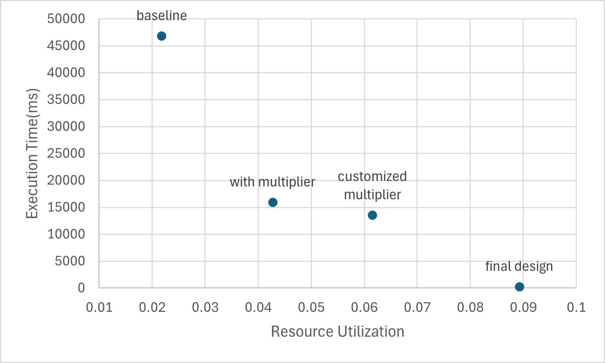

# CORDIC-Optimization-with-FPGA
The system is designed to accelerate evaluation of the following expression:

$$ 
y = \sum_{i=1}^{N} 0.5* x_{i}+x_{i}^2 * cos(\frac{x_{i}-128}{128})
$$

Customized blocks for single-precision floating point multiplication, addition and division were implemented. Cosine function computation was implmented as a customized block using CORDIC algorithm.
### Performance:

### Baseline System: 
All arithmetic calculations are implemented within the Nios II processor with only addition/subtraction support, which has 2kbytes each for instruction cache and data cache.

### Steps of Performance Optimization:
- fine-tune size of instruction cache and data cache
- add multiplier support
- add customized single precision floating point support
- add cusomized CORDIC implementation for evaluation of cosine and optimize the block for latency and throughput
- add DMA support
